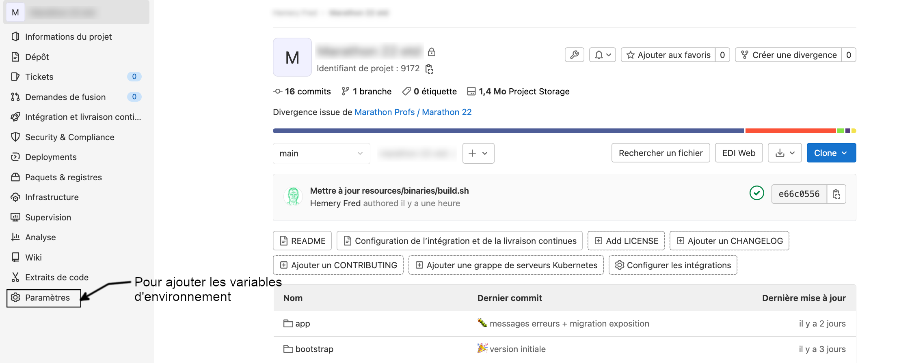
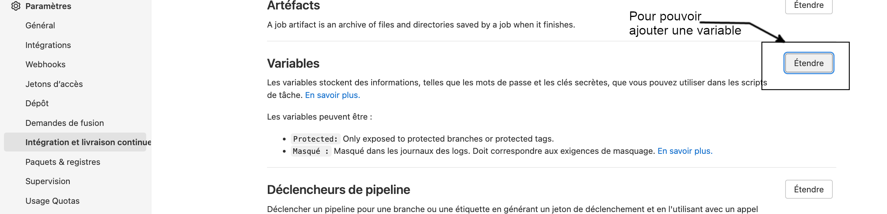
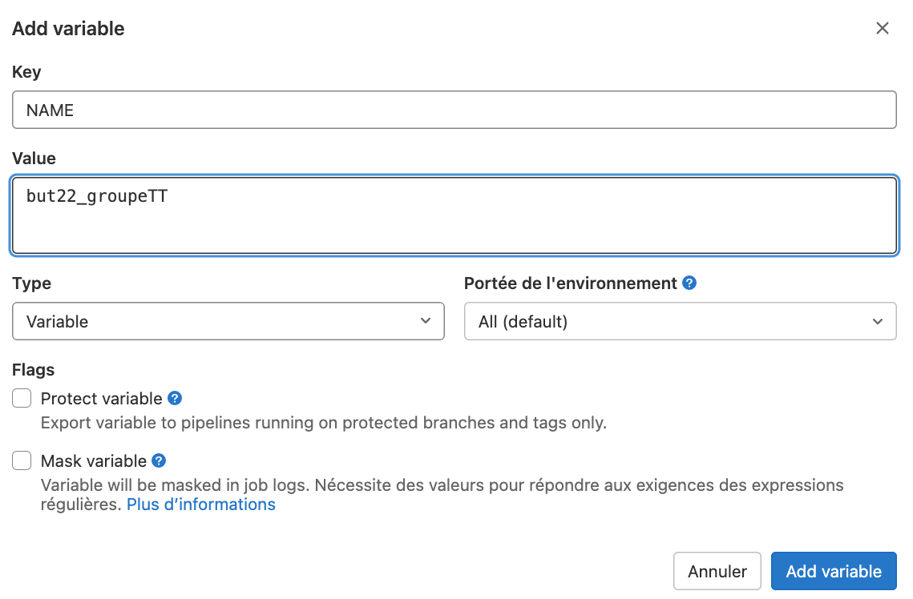
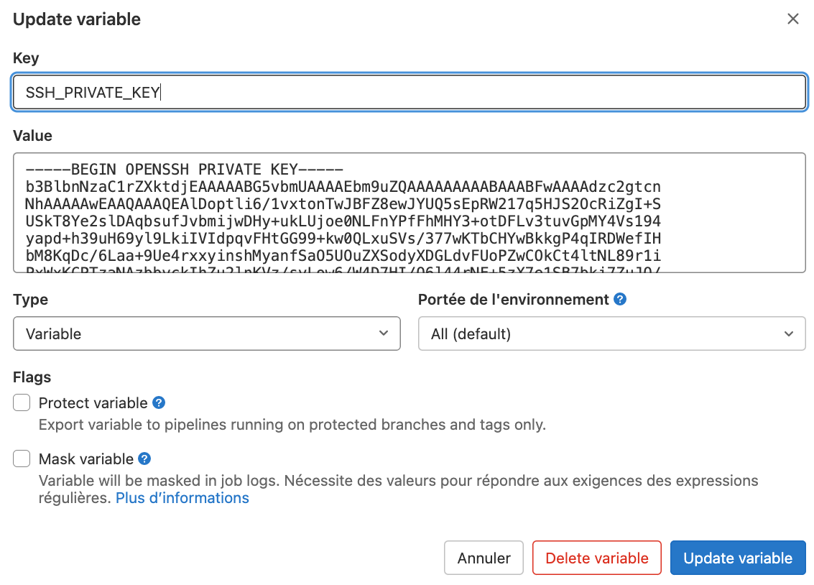

## Histoires dont vous êtes le héros

Groupe test but23_groupeTT

## Version initiale

Pour lancer avec succès une première version de votre site web pendant la phase de développement, il faut exécuter les
commandes suivantes sur votre machine de développement :

```shell
# A partir de la racine de votre projet

# installation des dépendances
composer install 

# installation des outils pour la construction du front
npm install 
# Modification du front en cours de développement
npm run dev
# Construction du front pour la version exploitation
npm run build

# liaison avec le SGBD et la base de données utilisée
cp .env.example .env


#########################################################
#
# Ici il faut modifier en particulier les variables suivantes
#
# DB_CONNECTION=mysql
# DB_HOST=127.0.0.1
# DB_PORT=3306
# DB_DATABASE=marathon_22
# DB_USERNAME=root
# DB_PASSWORD=
#
#
#########################################################

# Génération de la clé initiale

php artisan key:generate

# génération des tables dans votre base de données

php artisan migrate

# ou pour ré-initialiser

php artisan migrate:fresh

# Initialisation des données de départ

cp -r resources/images storage/app/public

# Création du lien physique en storage/app/public et public/storage

php artisan storage:link

# Ajout de données aléatoire dans les tables de la base de données

php artisan db:seed

# Lancement de l'application web pour le développement

php artisan serve
```

Si toutes les commandes précédentes ont été exécutées, votre application doit être accessible à
l'adresse [http://localhost:8000](http://localhost:8000)

## Le déploiement sur la machine marathon

Chaque modification de la branche main de votre projet sur [gitlab](https://gitlab.univ-artois.fr) entraine le
déploiement de votre site sur la machine marathon.

### Création des variables d'environnement

Pour que le déploiement se déroule bien, il faut configurer deux variables dans votre projet sur gitlab.

- Une variable `NAME` qui doit contenir votre nom de login sur la machine marathon qui vous a été délivré en début de
  marathon.
- Une variable `SSH_PRIVATE_KEY` qui doit contenir votre clé privée qui a été calculée pour vous et qui se trouve dans
  le fichier `~/.ssh/id_rsa` sur la machine marathon.

Pour modifier ces 2 variables, il faut

1. afficher dans votre navigateur, la page de votre projet sur gitlab.

   

2. Puis sélectionner _Paramètres_ ou _Setting_ et l'entrée _intégration et livraisons continues_ ou _CI/CD_.

   

3. Créez la variable `NAME`

   
4. Créez la variable `SSH_PRIVATE_KEY`

   

### Commandes sur la machine marathon

Lors du premier déploiement, vous devez initialiser l'environnement de votre site sur le serveur marathon.

Comme, la connexion avec la base de données.
Pour cela, vous devez à nouveau modifier le fichier `.env`.

Les commandes à taper lors du premier déploiement :

```shell
# liaison avec le SGBD et la base de données utilisée
cp .env.example .env

#########################################################
#
# Ici il faut modifier en particulier les variables suivantes
#
# DB_CONNECTION=mysql
# DB_HOST=127.0.0.1
# DB_PORT=3306
# DB_DATABASE=but22_groupeXX
# DB_USERNAME=but22_groupeXX
# DB_PASSWORD=password_but22_groupeXX
#
#
#########################################################

# Génération de la clé initiale

php artisan key:generate

# génération des tables dans votre base de données

php artisan migrate

# ou pour ré-initialiser

php artisan migrate:fresh

# Initialisation des données de départ

cp -r resources/images storage/app/public

# Création du lien physique en storage/app/public et public/storage

php artisan storage:link

# Ajout de données aléatoire dans les tables de la base de données

php artisan db:seed

```

À partir de là, votre site doit être visible avec l'url : `http://marathon/~but23_groupeXX` avec `XX` votre numéro
de groupe.

